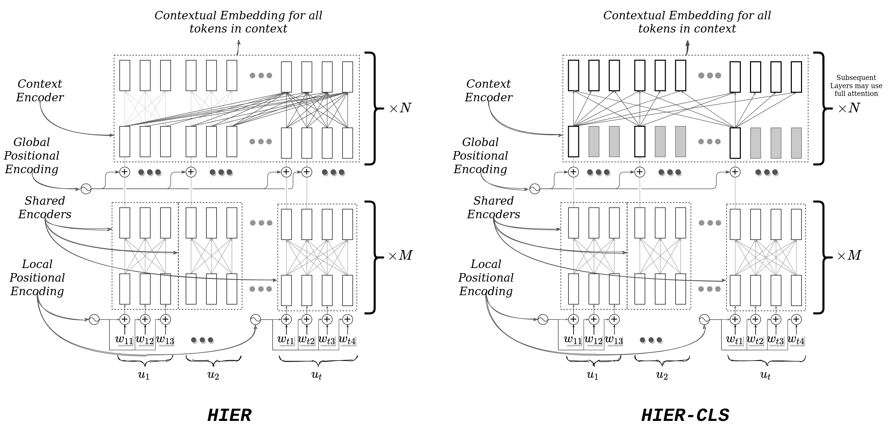

# HIER - Pytorch

Implementation of <a href="https://arxiv.org/abs/2011.08067">HIER</a>, in Pytorch

> **Title**: Hierarchical Transformer for Task Oriented Dialog Systems
> *Bishal Santra, Potnuru Anusha and Pawan Goyal*

## Abstract

Generative models for dialog systems have gained much interest because of the recent success of RNN and Transformer based models in tasks like question answering and summarization. Although the task of dialog response generation is generally seen as a sequence to sequence (Seq2Seq) problem, researchers in the past have found it challenging to train dialog systems using the standard Seq2Seq models. Therefore, to help the model learn meaningful utterance and conversation level features, Sordoni et al. (2015b); Serban et al. (2016) proposed Hierarchical RNN architecture, which was later adopted by several other RNN based dialog systems. With the transformer-based models dominating the seq2seq problems lately, the natural question to ask is the applicability of the notion of hierarchy in transformer based dialog systems. In this paper, we propose a generalized framework for Hierarchical Transformer Encoders and show how a standard transformer can be morphed into any hierarchical encoder, including HRED and HIBERT like models, by using specially designed attention masks and positional encodings. We demonstrate that Hierarchical Encoding helps achieve better natural language understanding of the contexts in transformer-based models for task-oriented dialog systems through a wide range of experiments.


</img>

**Figure 1:** Detailed Architecture for a **Hierarchical Transformer Encoder** or **HT-Encoder**: The main inductive bias incorporated in this model is to encode the full dialog context hierarchically in two stages. This is done by the two encoders, 1) Shared Utterance Encoder (M layers) and 2) Context Encoder (N layers), as shown in the figure. Shared encoder first encodes each utterance () individually to extract the utterance level features. The same parameterized Shared Encoder is used for encoding all utterances in the context. In the second Context Encoder the full context is encoded using a single transformer encoder for extracting dialog level features. The attention mask in context encoder decides how the context encoding is done and is a choice of the user. This one depicted in the figure is for the HIER model described in Section 2.3 of paper. Only the final utterance in the Context Encoder gets to attend over all the previous utterances as shown. This allows the model to have access to both utterance level features and dialog level features till the last layer of the encoding process. Notation: Utterance , ,  is the word embedding for  word in  utterance.

## Install

```bash
git clone 
bash extract_data.sh
```

## Usage

Please refer to instructions in this [repo](https://github.com/bsantraigi/hier-transformer-pytorch) for using the HT-Encoder architecture in your model to achieve hierarchical encoding in Transformer encoders.

## Citations

```bibtex
@misc{santra2021hierarchical,
      title={Hierarchical Transformer for Task Oriented Dialog Systems}, 
      author={Bishal Santra and Potnuru Anusha and Pawan Goyal},
      year={2021},
      eprint={2011.08067},
      archivePrefix={arXiv},
      primaryClass={cs.CL}
}
```

## Acknowledgements

We thank the authors and developers of [MarCo](https://github.com/InitialBug/MarCo-Dialog) and [HDSA](https://github.com/wenhuchen/HDSA-Dialog) for releasing their models and codes. The code of this work is derived from these two papers. We also thank the developers of [MultiWoz](https://github.com/budzianowski/multiwoz) for creating the dataset.
